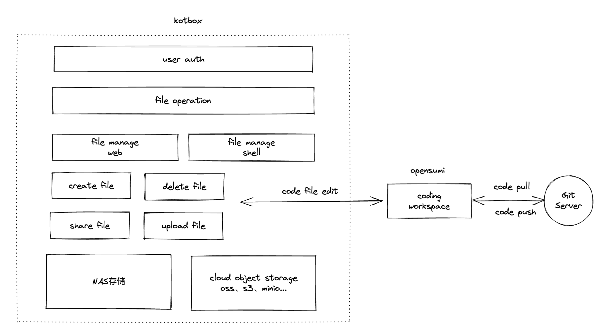
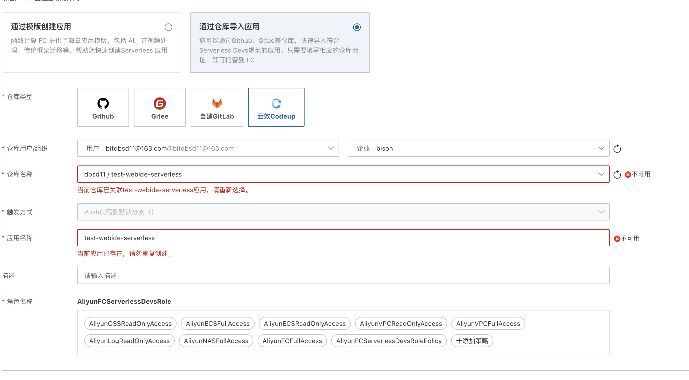
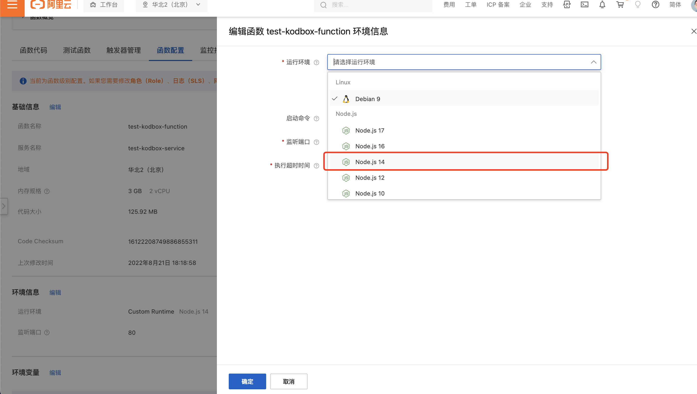
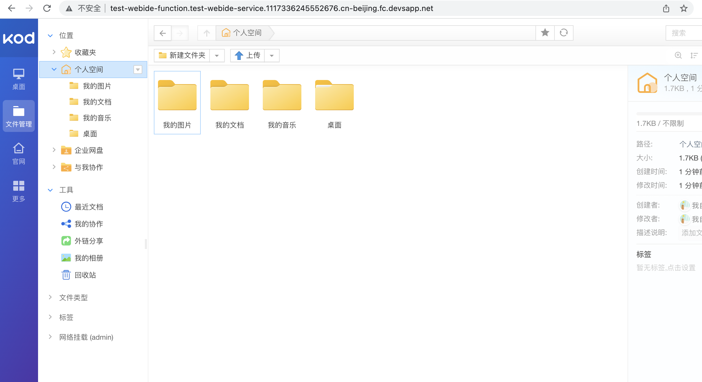

# test-webide-serverless

> ## 应用背景
>
> **实现一个 Serverless 架构的 Web IDE 服务**
>
> 在云的时代，IDE 越来越向着轻量化，分布式的方向演进。Vscode，IntelliJ Idea 等知名产品都推出了 Web IDE 版本。在小程序，Low code/No code，在线编程教育，前端一体化开发，大数据处理等领域，Web IDE 都体现了越来越重要的价值。Web IDE 的使用通常是多租户，碎片化的。基于传统架构，要实现一个多租安全，可扩展，高性能，低成本的 IDE 服务很复杂。而借助 Serverless 架构的，我们将大幅降低难度。我们将提供一个 Web IDE 服务的参考实现，您在此基础上进行扩展，发挥您的创意，创造一个独特的 Web IDE 服务！
>
> ## 技术架构实现、原理以及亮点
>
> * 强大的web ide能力，支持python、java、nodejs、php等语言的编程环境，支持代码断点调试，支持版本管理
> * 用户身份认证
> * 高效的文件分享
> * 支持多种云存储，如oss、s3等

###### 原理：

    web ide的开源软件有很多，阿里和蚂蚁开源的[opensumi](https://github.com/opensumi/ide-startup) 就是一个很理想的开源web ide。可以通过请求参数传参workspaceDir，来约束web ide的工作路径，在多租户场景可以用这个请求参数来实现多用户访问的隔离。同时基于此项目的[git]()插件，通过git源代码管理，可实现多用户分布式开发，同时基于git ops实现服务部署的ci/cd。

    但是仅仅有web ide还不够，如果项目中涉及较大文件的读写，比如数据处理项目对较大量训练数据的依赖，无法单单靠git去拉取整个数据文件。同时，如果有多用户间文件共享的需求，也无法靠git去灵活的实现。需要有另一套非源代码的文件管理服务。[kodbox](https://github.com/kalcaddle/kodbox) 是一款开源的基于web的文件管理工具，其强大的文件管理服务，可以很好的弥补web ide文件管理效率低的问题。

    综上两点，可以考虑采用文件管理+web ide的方式，实现一个基于web的高效的ide。

###### 架构图如下：



###### 亮点：搭开源工具的顺风车，随着开源工具迭代完善，也会支持更多功能。无需重复造轮子。同时通过部署在aliyun function compute上，实现服务的可扩展，高性能和低成本。

## 使用说明

1. 部署
   按如下图，创建函数计算应用：
   
2. 修改函数的runtime为nodejs14
   
3. 点击应用地址跳转应用主页，登录管理员账号：admin/admin
   
4. 打开web ide工具：{应用地址}/opensumi/index.html
   如：
```
http://test-webide-function.test-webide-service.1117336245552676.cn-beijing.fc.devsapp.net/opensumi/index.html
```
5. 只通过web ide访问对应workspace空间：{应用地址}/opensumi/index.html?workspaceDir=xxx。
   如：
```
   http://test-webide-function.test-webide-service.1117336245552676.cn-beijing.fc.devsapp.net/opensumi/index.html?workspaceDir=/tmp
```
   尝试创建文件，看是否可以编辑

## 实现说明

    由于时间紧张，目前只是简单的做了服务部署在serverless上的接入，无法完全满足多租户、安全的需求。未实现的功能如下：

1. kotbox和opensumi两者目前并未打通，使用起来不方便
2. 没有实现从kotbox跳转opensumi的用户身份校验
3. 目前是通过禁止web ide的终端功能避免非管理员用户提权，针对普通用户也需要使用终端的场景需要进行仔细考虑设计。

## 参考资料

1. [kotbox官网](http://kodcloud.com/)
2. [opensumi官网](https://opensumi.com/zh)
